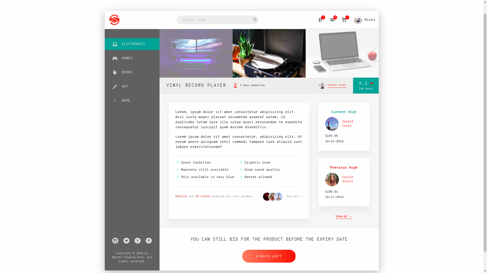

# BARTER TRADING POST #

**Barter Trading Post** is a Single-page layout of a user's auction dashboard. It is built using Sass, CSS, & HTML. 

## Table of Contents ##

1. Project Description
1. Technologies Used
1. Components 
1. Author's Notes 
1. Credits
1. Author 

### Project Description ###

This layout is basically a user's dashboard upon logging in and search for items for trade/auction. It is designed for a web app that handles barter trading among users. A user can post an item for trade, and other users can bid for that item by trading another item of equal value.

**Video**

_Please click on the image below to load video of project_

### Technologies Used ###

The following technologies were used to accomplish this project:

* Sass
* CSS flexbox
* HTML5
* npm 

### Components ###

**Header** 
  * Contains the Logo, Search Bar, User panel (notification, messages, saved items, profile).

**Side Panel**
  * Contains product categories, social media navigation, and copyright.

**Product Gallery**
  * Contains images of products, with current product as highlighted.

**Product Details**
  * Contains details about the current highlighted product. This includes, name, expiry, description, bullet details, post details (name, profile pic, karma points), current and previous high bids of bidders.

**Call to Action**
  * A call to action button to allow user to bid for item.

### Author's Notes ###

This is a mock-up project in order for me to get a firm grasp of flexbox. I decided to go with a dashboard simply because it has a lot of components that can be displayed using flexbox. 

### Credits ###

**Photos**

* **Current User Photo** by _Ana Tavares_ on Unsplash
* **Desktop Photo** by _XXSS IS BACK_ from Pexels
* **Laptop Photo** by _karsten madsen_ from Pexels
* **Vinly Record Photo** by _Snapwire_ from Pexels 
* **Seller Photo** by _Tim Savage_ from Pexels
* **bidder-1 Photo** by _Elti Meshau_ from Pexels
* **bidder-2 Photo** by _bruce mars_ from Pexels
* **bidder-3 Photo** by _YesManPro_ from Pexels
* **bidder-4 Photo** by _Pixabay_ from Pexels

**Design**

* **Design Inspiraton** from _Jonas Schmedtmann_ of https://www.codingheroes.io/

### Author ###

_Ruel Alfonso Misa_

